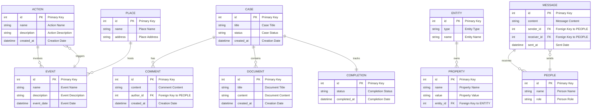

```mermaid
erDiagram
    ACTION {
        int id PK "Primary Key"
        string name "Action Name"
        string description "Action Description"
        datetime created_at "Creation Date"
    }
    CASE {
        int id PK "Primary Key"
        string title "Case Title"
        string status "Case Status"
        datetime created_at "Creation Date"
    }
    COMMENT {
        int id PK "Primary Key"
        string content "Comment Content"
        int author_id FK "Foreign Key to PEOPLE"
        datetime created_at "Creation Date"
    }
    COMPLETION {
        int id PK "Primary Key"
        string status "Completion Status"
        datetime completed_at "Completion Date"
    }
    DOCUMENT {
        int id PK "Primary Key"
        string title "Document Title"
        string content "Document Content"
        datetime created_at "Creation Date"
    }
    EVENT {
        int id PK "Primary Key"
        string name "Event Name"
        string description "Event Description"
        datetime event_date "Event Date"
    }
    ENTITY {
        int id PK "Primary Key"
        string type "Entity Type"
        string name "Entity Name"
    }
    MESSAGE {
        int id PK "Primary Key"
        string content "Message Content"
        int sender_id FK "Foreign Key to PEOPLE"
        int receiver_id FK "Foreign Key to PEOPLE"
        datetime sent_at "Sent Date"
    }
    PLACE {
        int id PK "Primary Key"
        string name "Place Name"
        string address "Place Address"
    }
    PEOPLE {
        int id PK "Primary Key"
        string name "Person Name"
        string role "Person Role"
    }
    PROPERTY {
        int id PK "Primary Key"
        string name "Property Name"
        string value "Property Value"
        int entity_id FK "Foreign Key to ENTITY"
    }
    
    CASE ||--o{ COMMENT : "has"
    CASE ||--o{ DOCUMENT : "contains"
    CASE ||--|| COMPLETION : "tracks"
    EVENT ||--o{ ACTION : "triggers"
    PEOPLE ||--o{ MESSAGE : "sends"
    MESSAGE ||--o{ PEOPLE : "receives"
    ENTITY ||--o{ PROPERTY : "owns"
    ACTION ||--o{ EVENT : "involves"
    PLACE ||--o{ EVENT : "hosts"
```